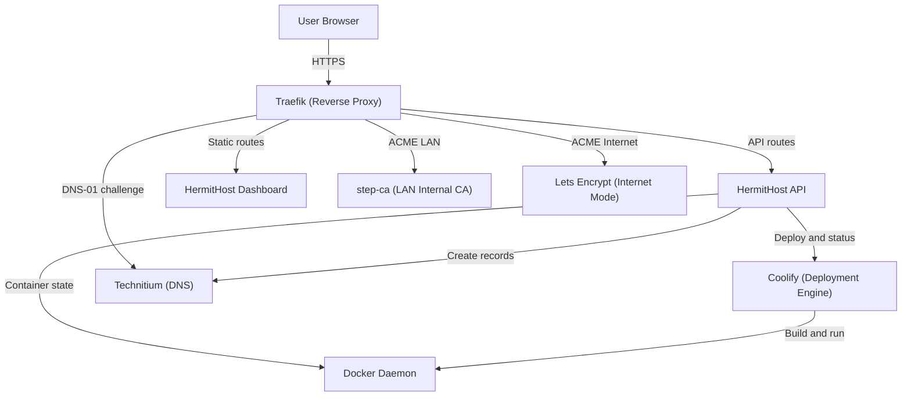
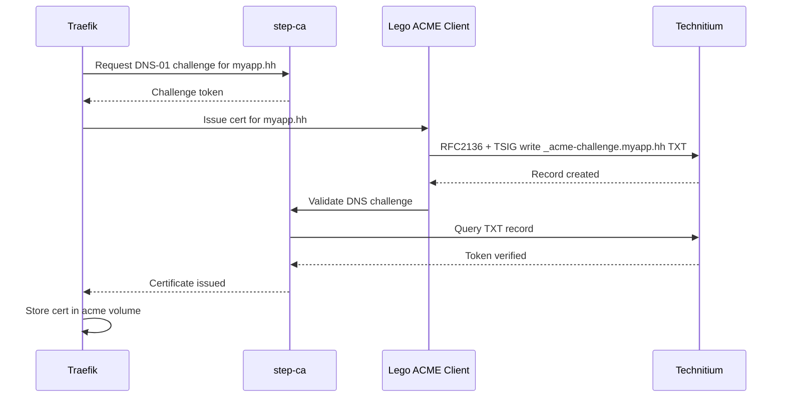
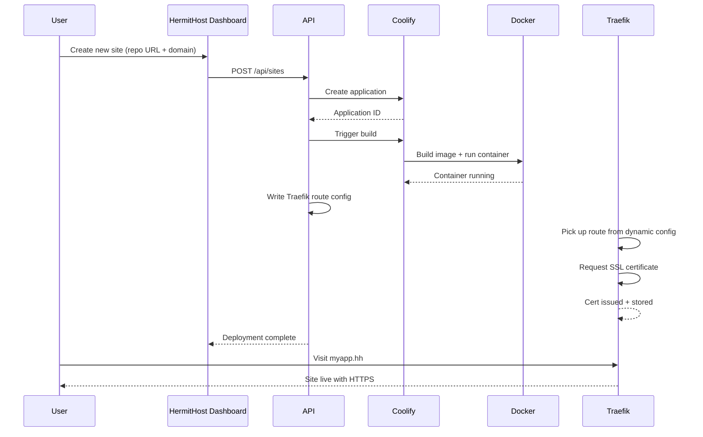

# HermitHost

[](https://opensource.org/licenses/MIT)
[](https://www.docker.com/)
[](https://nodejs.org/)

**A self-hosted platform dashboard for deploying web apps with automatic DNS and SSL — no cloud required.**

## What is HermitHost?

HermitHost is a unified control panel that wraps Coolify (deployment engine), Technitium or Cloudflare (DNS), and Traefik (reverse proxy + SSL) into a single, intuitive dashboard. Deploy web applications from Git repositories, manage DNS records, monitor application health, and issue HTTPS certificates — all without complex configuration or cloud dependencies.

HermitHost operates in two modes: **LAN mode** runs everything on your local network with a private `.hh` TLD and internal CA (step-ca), while **Internet mode** uses public domains and Let's Encrypt for HTTPS. Both modes automatically handle certificate renewal and DNS provisioning. The dashboard is the only interface you interact with — the underlying infrastructure (Coolify, Technitium, Traefik) remains abstracted and automatically managed.

Key capabilities include deploying sites from any Git repository, creating and managing DNS records, monitoring application HTTP status and SSL certificate expiry in real time, managing Docker container lifecycles, streaming deployment logs, and exporting/importing full system backups. Whether you're running a home lab, private cloud, or small-scale production environment, HermitHost simplifies self-hosting without sacrificing control.

## Architecture Overview

HermitHost coordinates three core services to provide its full-stack functionality. Traefik acts as the reverse proxy and SSL termination point, receiving requests from browsers and routing them to the HermitHost dashboard, API, or deployed applications. The HermitHost API (Express.js) serves as the orchestration layer, communicating with Coolify to manage application deployments, Technitium/Cloudflare to manage DNS records, Docker to monitor container state, and step-ca (in LAN mode) to issue certificates. The frontend (SvelteKit) provides the dashboard interface.

### Service Topology



### LAN Mode SSL Certificate Issuance



### Site Deployment Flow



## Features

- **One-command setup** — `bash scripts/setup.sh` handles all initialization interactively
- **Two operating modes** — LAN mode (`.hh` TLD, internal CA, DNS-01) and Internet mode (public domains, Let's Encrypt, HTTP-01)
- **Automatic SSL certificates** — ACME-based issuance and renewal; step-ca for LAN, Let's Encrypt for Internet
- **Git-based deployments** — Deploy applications from any Git repository via the Coolify integration
- **Unified DNS management** — Bundled Technitium for internal networks or switchable Cloudflare for public domains
- **Real-time health monitoring** — HTTP status, SSL expiry dates, and DNS resolution checks cached every 60 seconds
- **Deployment log streaming** — Watch builds and deployments in real time from the dashboard
- **Docker container management** — Start, stop, restart, and inspect all running containers
- **Backup and restore** — Export full system configuration as JSON, import to restore or migrate
- **TSIG-authenticated dynamic DNS** — Secure DNS record provisioning via RFC2136
- **Docker socket proxy** — Least-privilege container access with an unprivileged proxy daemon
- **Automatic state checkpoint** — Container state captured on shutdown; containers restored to prior state on restart

## Prerequisites

- **Docker** v20.10 or later and **Docker Compose** v2.20 or later
- **Operating System:** Linux (recommended), macOS with Docker Desktop, or WSL2
- **Memory:** 4GB minimum (8GB recommended)
- **Disk space:** 10GB minimum
- **Ports:** 80/443 (LAN mode) or 8080/8443 (Internet mode), 53 or 53053 (DNS)
- **Public IP or hostname** (Internet mode only — required for Let's Encrypt validation)

## Quick Start

Clone the repository and run the interactive setup:

```bash
git clone https://github.com/your-org/hermithost.git
cd hermithost
bash scripts/setup.sh
```

The setup script will ask you:
1. **Operating mode:** LAN (internal `.hh` domains) or Internet (public domains)
2. **ACME email:** Your email for SSL certificate notifications
3. **Server hostname:** Your server's IP address or public hostname (Internet mode only)

Then start the stack:

```bash
bash scripts/start.sh
```

Access the HermitHost dashboard:
- LAN mode: https://hermithost.hh (after pointing your DNS resolver at HermitHost)
- Internet mode: https://hermithost.yourdomain.com

## Installation — Detailed

### Step 1: Clone and Configure

```bash
git clone https://github.com/your-org/hermithost.git
cd hermithost
cp .env.template .env
```

Edit `.env` and set these operator-configurable variables:

```bash
# Required
HERMITHOST_PORT_MODE=lan              # or "internet"
ACME_EMAIL=your-email@example.com      # SSL certificate notifications
NS_HOSTNAME=192.168.1.100              # Your server IP (LAN) or hostname (Internet)

# Optional (can be set in dashboard later)
DNS_PROVIDER=technitium                # or "cloudflare"
COOLIFY_PORT=8000
DNS_PORT=53053                         # 53 if allowed; default avoids conflicts
STEP_CA_PASSWORD=your-secure-password  # LAN mode only
```

Or run the interactive setup:

```bash
bash scripts/setup.sh
```

### Step 2: Run Setup Script

```bash
bash scripts/setup.sh
```

This script will:
- Generate all required secrets (database passwords, TSIG keys, API tokens)
- Configure the Technitium TSIG key for secure DNS updates
- Set up Traefik dynamic config directory
- Activate Git pre-commit hooks (PII blocking)
- In LAN mode: initialize step-ca and root CA certificate

The script is idempotent — safe to run multiple times; it only fills empty values and never overwrites existing configuration.

### Step 3: Start the Stack

```bash
bash scripts/start.sh
```

In LAN mode, this starts step-ca and step-ca-init. In Internet mode, these services are skipped. Traefik will begin issuing certificates immediately.

### Step 4: First Login

Open the HermitHost dashboard — everything is managed from here:
- LAN mode: https://hermithost.hh (after pointing your DNS resolver at HermitHost)
- Internet mode: https://hermithost.yourdomain.com

Log in with the `HERMITHOST_PASSWORD` you set (or configured via Settings after first run).

## Operating Modes

### LAN Mode

LAN mode runs HermitHost entirely within your local network using a private `.hh` top-level domain. All sites are only accessible from devices on your LAN; no public internet access is required.

**How it works:**
- **DNS:** Technitium runs as your local DNS resolver on port 53 (or DNS_PORT). All `.hh` queries resolve to your HermitHost server.
- **SSL certificates:** step-ca acts as an internal Certificate Authority. Traefik requests certificates for `*.hh` domains via ACME DNS-01 challenges. The challenge is written to Technitium via RFC2136 (TSIG-authenticated dynamic DNS), validated, and the certificate is issued by step-ca.
- **Setup:** Point your devices' DNS resolver to your HermitHost server's IP and port 53 (or DNS_PORT). Install the step-ca root CA certificate in your browser's or OS trust store (available in Settings → SSL).

**Example DNS flow:**
```
laptop (192.168.1.50)
  → queries hermithost.hh
  → resolver configured to Technitium (192.168.1.100:53)
  → Technitium returns hermithost.hh = 192.168.1.100
  → laptop connects to https://hermithost.hh
```

### Internet Mode

Internet mode runs HermitHost with public domain names, making it accessible over the internet. Traefik obtains certificates from Let's Encrypt.

**How it works:**
- **Domains:** You own a public domain (e.g., `example.com`). Point your domain's DNS A record to your HermitHost server's public IP address.
- **SSL certificates:** Traefik requests certificates from Let's Encrypt using HTTP-01 validation. Let's Encrypt verifies you control the domain by requesting `http://yourdomain.com/.well-known/acme-challenge/token`. Traefik listens on port 8080 (configurable) to serve this challenge.
- **Access:** Sites are live at https://myapp.yourdomain.com once their DNS A record is configured and the certificate is issued.

**Ports:**
- Traefik HTTP: port 8080 (configurable TRAEFIK_HTTP_PORT)
- Traefik HTTPS: port 8443 (configurable TRAEFIK_HTTPS_PORT)

These avoid conflicts with system services on port 80/443.

## Deploying Your First Site

1. **Open the HermitHost dashboard** — navigate to http://localhost:3000 or your configured HermitHost domain
2. **Click "Add Site"** — enter your Git repository URL and desired domain name
3. **HermitHost provisions everything:**
   - DNS A record (pointing to your server)
   - Traefik route (proxies requests to the deployed app)
   - Coolify application (clones repo, builds, deploys)
4. **Monitor deployment logs** — view real-time build output in the site detail page
5. **Access your site** — once deployment completes, visit https://yourdomain.hh (LAN) or https://yourdomain.com (Internet)

## DNS Management

The dashboard provides full DNS zone and record management. The default DNS provider is **Technitium** (bundled, no external dependencies). You can switch to **Cloudflare** anytime via Settings.

### Using Technitium (Default)

Technitium is deployed automatically. Access the Technitium UI at http://localhost:5380 (internal only). No additional setup is required.

### Using Cloudflare

To use Cloudflare as your DNS provider:

1. **Create a Cloudflare API token:**
   - Go to https://dash.cloudflare.com/profile/api-tokens
   - Create a custom token with permissions: **Zone:Edit** and **Zone:Create** (account-level scopes)
   - Note: The "Edit zone DNS" template is insufficient — you must use a custom token with both permissions

2. **Configure in HermitHost:**
   - Open the dashboard → Settings → DNS Provider
   - Select "Cloudflare"
   - Paste your API token
   - Click "Save" — the system will verify connectivity

3. **Use your domain's Cloudflare nameservers** — ensure your registrar points your domain to Cloudflare

## SSL Certificate Management

HermitHost automates SSL certificate issuance and renewal. Certificates are stored in the `traefik-acme` volume and never require manual management.

### LAN Mode Certificates

- **Issuer:** step-ca (internal CA)
- **Validity:** 30 days
- **Renewal:** Automatic (Traefik renews at 14 days remaining)
- **Trust:** Must install the step-ca root CA certificate in your browser/OS
  - Download from: Settings → SSL → Download Root CA
  - Import into your browser's certificate store

### Internet Mode Certificates

- **Issuer:** Let's Encrypt
- **Validity:** 90 days
- **Renewal:** Automatic (Traefik renews at 30 days remaining)
- **No installation needed:** Let's Encrypt root CAs are trusted by all browsers

### Viewing Active Certificates

View all active certificates in the dashboard: Settings → SSL

To inspect certificates via Docker:

```bash
docker exec traefik cat /acme/acme.json
```

## Operational Scripts

| Script | Description |
|--------|-------------|
| `bash scripts/setup.sh` | First-time initialization: generates secrets, configures services, provisions Coolify credentials |
| `bash scripts/start.sh` | Start the HermitHost stack (applies correct mode automatically) |
| `bash scripts/stop.sh` | Gracefully stop all deployed site containers and HermitHost services; checkpoints container state |
| `bash scripts/restart.sh` | Restart the entire stack |
| `bash scripts/status.sh` | Display service status and health check results |
| `bash scripts/rotate-tsig.sh` | Rotate the TSIG secret for secure DNS updates (requires Traefik restart after) |

## Environment Variables

Operator-configurable variables in `.env`. For the complete list, see `.env.template`.

| Variable | Description | Default |
|----------|-------------|---------|
| `HERMITHOST_PORT_MODE` | Operating mode: `lan` or `internet` | *(prompted)* |
| `ACME_EMAIL` | Email for SSL cert notifications | *(prompted)* |
| `NS_HOSTNAME` | Server IP (LAN) or hostname (Internet) | *(prompted)* |
| `DNS_PROVIDER` | Active DNS provider: `technitium` or `cloudflare` | `technitium` |
| `CLOUDFLARE_TOKEN` | Cloudflare API token (also settable in Settings UI) | *(empty)* |
| `COOLIFY_PORT` | Internal deployment engine port | `8000` |
| `DNS_PORT` | Host port for DNS (use 53 if allowed; avoid conflicts) | `53053` |
| `TRAEFIK_HTTP_PORT` | Traefik HTTP port (Internet mode) | `8080` |
| `TRAEFIK_HTTPS_PORT` | Traefik HTTPS port (Internet mode) | `8443` |
| `STEP_CA_PASSWORD` | step-ca (LAN mode) password | *(auto-generated)* |
| `TECHNITIUM_URL` | Technitium API endpoint | `http://technitium:5380` |

## Architecture Reference

### Services

| Service | Image/Tech | Purpose | Ports |
|---------|-----------|---------|-------|
| **HermitHost API** | Node.js/Express | Orchestration layer; Coolify/DNS/Docker abstraction | 3001 |
| **HermitHost Dashboard** | Node.js/SvelteKit | Web UI | 3000 |
| **Traefik** | traefik:v3 | Reverse proxy, ACME client, SSL termination | 80, 443, 8080, 8443 |
| **Coolify** | coolify/coolify | Application deployment engine (internal) | — |
| **Technitium DNS** | technitium/technitium-core | DNS resolver and authoritative server | 53 (or DNS_PORT) |
| **step-ca** | smallstep/step-ca | Internal CA (LAN mode only) | 9000 |
| **PostgreSQL** | postgres:15 | Coolify database | 5432 |
| **Redis** | redis:7 | Coolify cache and queue | 6379 |

### Volumes

| Volume | Purpose | Data |
|--------|---------|------|
| `traefik-acme` | ACME certificates and metadata | JSON (acme.json) |
| `coolify-db` | PostgreSQL data | Database tables |
| `coolify-redis` | Redis persistence | Cache/queue data |
| `technitium-config` | DNS zones and records | JSON config |
| `step-ca-config` | step-ca PKI data (LAN mode) | Certificates, keys |

### Networks

**hermithost-net:** Bridges HermitHost API, dashboard, and infrastructure services.

**coolify (external network):** Shared with all deployed applications; allows Coolify containers to communicate.

## Backup and Restore

### Dashboard Backup

1. Open the dashboard → Settings → Backup
2. Click "Export" to download a JSON archive containing all sites, DNS records, and configuration
3. Save this file in a secure location

### CLI Backup

```bash
curl -X GET http://localhost:3000/api/backup/export > hermithost-backup.json
```

### Restoring

1. Open the dashboard → Settings → Backup
2. Click "Import" and select your backup JSON file
3. The system will validate the backup before restoring

Automatic state checkpoint occurs on graceful shutdown (`scripts/stop.sh`). Containers are restored to their prior state when the stack restarts.

## Contributing

Contributions are welcome. To contribute:

1. Fork the repository
2. Create a feature branch: `git checkout -b feature/my-feature`
3. Git hooks are automatically activated by `scripts/setup.sh` — they block commits containing PII
4. Run tests: `npm run test`
5. Validate Docker builds: `docker compose build`
6. Commit and push: `git push origin feature/my-feature`
7. Open a pull request

Note: The pre-commit hook (`git config core.hooksPath .githooks`) blocks accidental commits of secrets, API keys, and email addresses.

## License

HermitHost is licensed under the MIT License. See [LICENSE](LICENSE) for details.
